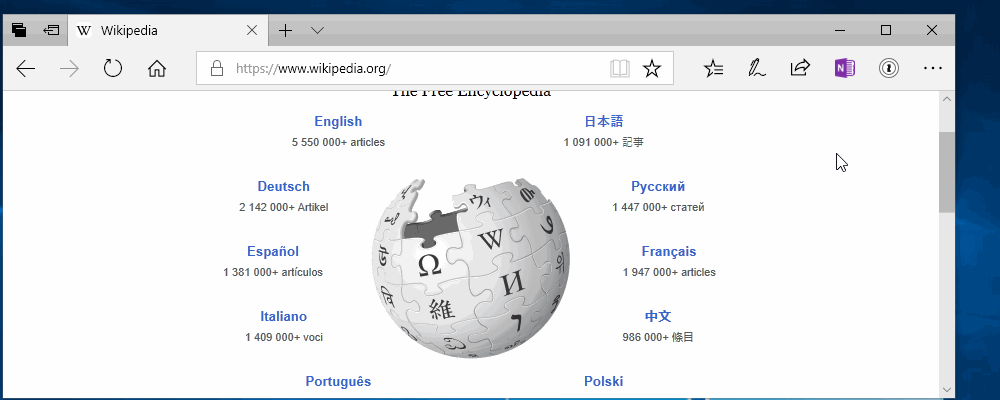

  

## Reset Microsoft Edge's settings to the Default Homepage

1. In Microsoft Edge, click on the **··· button** (i.e. **Settings and more** button)
2. Select **Settings** at the bottom of the menu 
3. Select **Start page** in the **Open Microsoft Edge with** box

## Open a new window
1. In Microsoft Edge, click on the **··· button** (i.e. **Settings and more** button)
2. Select **New window**
 - Warning:  **Do not** click on the '+' button. That incorrectly opens a new tab.
 - If you see an Edge introduction page, please skip through the experience until you see the default homepage
3. When you see Microsoft Edge's default homepage, move on to the next task.

<!--

-->

